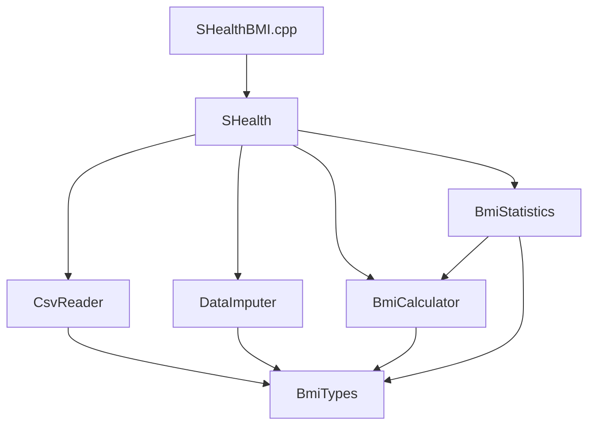

# SHealth BMI 프로젝트 — 2차 리팩토링 보고서

| 항목 | 내용 |
|------|------|
| **작성일** | 2026-05-19 |
| **대상** | SHealth_12 (C++ / CMake / Google Test) |
| **범위** | SRP 클래스 분리 · README 4단계 기능 추가 · 테스트 확장 |
| **선행 작업** | [1차_Refactoring_보고서.md](./1차_Refactoring_보고서.md) |
| **상태** | 2차 완료 |

---

## 1. 개요

본 보고서는 **1차 리팩토링** 이후 수행한 **2차 리팩토링** 결과를 정리한 문서입니다.  
README 실습 계획 **「4. 기능 개선 (2시간)」** 항목을 기준으로, God Class를 역할별 클래스로 분리하고 신규 통계·조회 기능을 추가했습니다.

### 1.1 2차 목표 (README 기준)

| # | 목표 | 수행 |
|---|------|------|
| 1 | SRP에 따른 책임 분리 리팩토링 | ✅ |
| 2 | 특정 연령대의 BMI 분포 비율 계산 기능 | ✅ |
| 3 | Height가 0인 경우 평균치 보정 | ✅ |
| 4 | BMI 정상 범위 사용자 목록 조회 | ✅ |
| 5 | 전체 사용자 대비 각 BMI 범주 비율 | ✅ |

---

## 2. 1차 → 2차 변화 요약

### 2.1 구조 Before / After

**Before (1차 완료 시점)**

```
SHealth (단일 클래스)
  ├── CSV 로드·파싱
  ├── 체중 0 보정
  ├── BMI 계산·분류
  ├── 연령대별 통계
  └── 비율 조회 API
```

**After (2차 완료)**

```
SHealth (파사드)
  ├── CsvReader        … CSV 로드·파싱
  ├── DataImputer      … 체중·키 0 보정
  ├── BmiCalculator    … BMI 계산·분류
  ├── BmiStatistics    … 연령대/전체 통계·정상 사용자 ID
  └── BmiTypes         … 공통 타입·상수
```

### 2.2 파일 구조

```
src/main/cpp/
  BmiTypes.h / BmiTypes.cpp       ← enum, HealthRecord, 연령대 유틸
  CsvReader.h / CsvReader.cpp     ← CSV I/O
  BmiCalculator.h / .cpp          ← BMI 계산·분류
  DataImputer.h / .cpp            ← 결측치 보정 (weight, height)
  BmiStatistics.h / .cpp          ← 통계 집계·조회
  SHealth.h / SHealth.cpp         ← 파사드 (공개 API 유지)
  SHealthBMI.cpp                    ← main (신규 출력)
src/test/cpp/
  SHealthBMITest.cpp              ← 9개 TC
```

---

## 3. 클래스별 책임 (SRP)

| 클래스 | 단일 책임 | 주요 API |
|--------|----------|----------|
| **BmiTypes** | 도메인 타입·상수 정의 | `HealthRecord`, `BmiCategory`, `AgeDecade::*`, `BmiThresholds` |
| **CsvReader** | CSV 파일 → 레코드 목록 | `load(filename, records)` |
| **DataImputer** | 연령대별 결측치 평균 대체 | `imputeMissingValues(records)` |
| **BmiCalculator** | BMI 수식·4분류 | `compute()`, `classify()`, `applyToAll()` |
| **BmiStatistics** | 집계·분포·ID 목록 | `compute()`, `getDecadeDistribution()`, `getOverallDistribution()`, `getNormalBmiUserIds()` |
| **SHealth** | 파이프라인 조율·하위 호환 API | `processFile()`, 1차 API 위임 |

### 3.1 처리 파이프라인

```
processFile(filename)
    │
    ├─► CsvReader::load()           records_ 채움 (id 포함)
    │
    ├─► DataImputer::imputeMissingValues()
    │       ├─ weightKg == 0  → 동 연령대 평균 체중
    │       └─ heightCm == 0  → 동 연령대 평균 키
    │
    ├─► BmiCalculator::applyToAll()
    │
    └─► BmiStatistics::compute()
            ├─ 연령대별 4분류 비율 (%)
            ├─ 전체 4분류 비율 (%)
            └─ 정상 BMI 사용자 id 수집
```

### 3.2 아키텍처 다이어그램



---

## 4. 신규·변경 API

### 4.1 신규 공개 API (`SHealth`)

| 메서드 | 반환 | 설명 |
|--------|------|------|
| `getDecadeDistribution(ageDecade)` | `CategoryRatios` | 연령대 BMI 4분류 비율 배열 `[저체중, 정상, 과체중, 비만]` |
| `getOverallDistribution()` | `CategoryRatios` | **전체 사용자** BMI 4분류 비율 |
| `getOverallCategoryRatio(category)` | `double` | 전체 단일 분류 비율 |
| `getNormalBmiUserIds()` | `vector<int>` | 정상 BMI(18.5 초과 ~ 23 미만) 사용자 **ID** 목록 |
| `records()` | `const vector<HealthRecord>&` | 처리된 레코드 조회 (디버그·확장용) |

### 4.2 `HealthRecord` 확장

1차에는 `id`가 파싱되지 않았으나, 2차에서 **정상 BMI 사용자 목록** 기능을 위해 추가했습니다.

```cpp
struct HealthRecord {
    int id = 0;          // 2차 추가
    int age = 0;
    double weightKg = 0.0;
    double heightCm = 0.0;
    double bmi = 0.0;
};
```

### 4.3 하위 호환 (1차 API 유지)

| API | 2차 동작 |
|-----|----------|
| `processFile(filename)` | 파사드에서 동일 시그니처, 내부만 분리 |
| `getCategoryRatio(ageDecade, category)` | `BmiStatistics` 위임 |
| `getBmiRatio(ageDecade, typeCode)` | type 100~400 → `BmiCategory` 매핑 유지 |
| `computeBmi` / `classifyBmi` | `BmiCalculator` static 위임 |
| `kMinAgeDecade` ~ `kTypeObesity` | `AgeDecade` / 상수 alias 유지 |

---

## 5. 기능 상세

### 5.1 연령대 BMI 분포 (`getDecadeDistribution`)

- 1차의 `getCategoryRatio`를 **4개 한 번에** 조회할 수 있도록 배열 API 제공.
- 내부적으로 `BmiStatistics`가 연령대별 `CategoryRatios[4]`를 보관.
- `getCategoryRatio(decade, cat)` 값과 `getDecadeDistribution(decade)[cat]` **일치** (TC로 검증).

### 5.2 Height = 0 보정 (`DataImputer`)

- **규칙**: `heightCm == 0`이면, 동일 연령대(10년 단위, 20~70)에서 `height > 0`인 사용자의 **평균 키**로 대체.
- 체중 보정과 동일 패턴으로 `imputeHeightsByAgeDecade()` 구현.
- 처리 순서: **체중 보정 → 키 보정 → BMI 계산** (보정 후 BMI 산출).

### 5.3 전체 사용자 BMI 비율 (`getOverallDistribution`)

- 연령대 구분 없이 `bmi > 0`인 모든 레코드를 대상으로 4분류 비율(%) 산출.
- 네 분류 비율 합 ≈ **100%** (TC `OverallCategoryRatio`).

### 5.4 정상 BMI 사용자 목록 (`getNormalBmiUserIds`)

- `BmiCalculator::classify(bmi) == BmiCategory::Normal` 인 레코드의 **id** 수집.
- `shealth.dat` 기준 실행 시 **654명** (프로젝트 루트에서 실행 기준).

---

## 6. `SHealthBMI.cpp` 출력 변경

2차에서 main 출력을 확장했습니다.

| 구간 | 내용 |
|------|------|
| `[Age-decade BMI distribution]` | 20~70대 연령대별 4분류 비율 (1차와 동일 형식) |
| `[Overall BMI distribution]` | 전체 사용자 4분류 비율 |
| `[Normal BMI users]` | 정상 BMI 사용자 수 + ID 미리보기(최대 10건) |

### 6.1 실행 결과 예시 (`shealth.dat`)

**연령대별**

```
20 - underweight = 3.51, normal = 23.80, overweight = 11.83, obesity = 60.86
30 - underweight = 1.86, normal = 15.53, overweight = 10.06, obesity = 72.55
...
```

**전체**

```
underweight = 1.60%
normal      = 13.56%
overweight  = 10.39%
obesity     = 74.45%
```

**정상 BMI 사용자**

```
count = 654
id = 93711, 93715, ... (미리보기 10건)
```

---

## 7. 단위 테스트

### 7.1 테스트 목록 (9건)

| # | 테스트 | 검증 내용 |
|---|--------|----------|
| 1 | `ComputeBmi` | `BmiCalculator` + `SHealth` 위임 |
| 2 | `ClassifyBmiBoundaries` | 18.5 / 23 / 25 경계 |
| 3 | `ImputeMissingWeightByDecade` | 체중 0 보정 |
| 4 | `ImputeMissingHeightByDecade` | **키 0 보정** (2차) |
| 5 | `DecadeDistributionMatchesCategoryRatio` | **분포 API 일관성** (2차) |
| 6 | `OverallCategoryRatio` | **전체 비율 합 100%** (2차) |
| 7 | `NormalBmiUserIds` | **정상 BMI ID 1건** (2차) |
| 8 | `LegacyTypeCodeCompatibility` | type 100~400 호환 |
| 9 | `SkipsInvalidRows` | 잘못된 행 skip |

### 7.2 실행 결과

```
100% tests passed, 0 tests failed out of 9
Total Test time (real) ≈ 0.22 sec
```

### 7.3 빌드·테스트 명령

```powershell
cd c:\DEV\SHealth_12\build
cmake ..
cmake --build .
ctest --output-on-failure

cd c:\DEV\SHealth_12
.\build\Debug\SHealthBMI.exe
```

---

## 8. CMake 변경

`shealth_lib`에 2차 소스 6개를 추가 링크했습니다.

```cmake
add_library(shealth_lib
    src/main/cpp/BmiTypes.cpp
    src/main/cpp/CsvReader.cpp
    src/main/cpp/BmiCalculator.cpp
    src/main/cpp/DataImputer.cpp
    src/main/cpp/BmiStatistics.cpp
    src/main/cpp/SHealth.cpp
)
```

---

## 9. 1차 대비 개선 지표

| 항목 | 1차 | 2차 |
|------|-----|-----|
| 핵심 클래스 수 | 1 (`SHealth`) | 6 (역할 분리) |
| `SHealth.cpp` 역할 | 로직 전부 포함 (~195행) | 파사드 (~60행) |
| 결측치 보정 | 체중만 | 체중 + **키** |
| 통계 범위 | 연령대별만 | 연령대 + **전체** |
| 사용자 조회 | 없음 | **정상 BMI ID 목록** |
| 분포 조회 | 개별 `getCategoryRatio` | + **`getDecadeDistribution`** |
| 단위 테스트 | 5건 | **9건** |
| `HealthRecord.id` | 미사용 | **파싱·활용** |

---

## 10. 잔여·향후 과제

| 항목 | 설명 |
|------|------|
| CLI 인자 | `shealth.dat` 경로 하드코딩 → 실행 인자·상대 경로 개선 |
| 연령대 외 구간 | 10대·80대 등 `AgeDecade` 범위 밖 데이터 정책 명시 |
| 통합 TC | 실제 `shealth.dat` 기준 전체/정상 ID 개수 회귀 테스트 |
| 예외 TC 확장 | 대용량·손상 비율·보정 불가 연령대 등 |
| 리포트 연계 | 발표용 Before/After 수치·아키텍처 슬라이드 |

---

## 11. 회고 (2차)

### 11.1 달성

- 1차에서 남았던 **클래스 수준 SRP**를 역할별 파일로 분리해, 기능 추가 시 수정 범위를 줄였다.
- README 4단계 요구 기능 5항목을 **API·TC·main 출력**까지 일관되게 반영했다.
- 1차 공개 API를 유지해 **기존 호출 코드·테스트 호환**을 확보했다.

### 11.2 설계 선택

- **파사드 패턴**: 외부는 `SHealth`만 사용, 내부 교체·테스트 용이.
- **보정 순서**: 체중 → 키 → BMI로 고정해 결측치 의존성을 명확히 함.
- **통계 단일 클래스**: 연령대·전체·ID 목록을 `BmiStatistics`에 모아 집계 로직 중복 방지.

### 11.3 한계

- `SHealth`가 여전히 유일한 진입점이며, 도메인 서비스 인터페이스(추상화)는 도입하지 않음.
- 정상 BMI 목록은 **전체 id 벡터** 반환만 지원 (페이징·필터 없음).
- 테스트는 대부분 **임시 CSV** 기반이며, `shealth.dat` 통합 검증은 미포함.

---

## 12. 부록 — 코드 스니펫

### 12.1 파사드 `processFile`

```cpp
int SHealth::processFile(const std::string& filename) {
    records_.clear();
    if (!csvReader_.load(filename, records_)) {
        return -1;
    }
    DataImputer::imputeMissingValues(records_);
    BmiCalculator::applyToAll(records_);
    statistics_.compute(records_);
    return static_cast<int>(records_.size());
}
```

### 12.2 신규 API 사용 예

```cpp
SHealth shealth;
shealth.processFile("shealth.dat");

// 연령대 분포 (한 번에)
CategoryRatios d20 = shealth.getDecadeDistribution(20);

// 전체 비율
double normalOverall = shealth.getOverallCategoryRatio(BmiCategory::Normal);

// 정상 BMI 사용자 ID
std::vector<int> normalIds = shealth.getNormalBmiUserIds();
```

---

*본 문서는 2차 리팩토링(SRP 분리·기능 개선·테스트 확장) 작업 결과를 바탕으로 작성되었습니다. 1차 내용은 [1차_Refactoring_보고서.md](./1차_Refactoring_보고서.md)를 참고하세요.*
